# 17일차 분석 snapshot 카드 기획

작성일: 2026-09-28 · 상태: **구현 반영 / 회귀 검증 완료**

이 문서는 서버가 Delta 또는 raw 원천에서 게시한 `game-summary.json`을 Pygame 접속기에서 안전하게 읽고 표시하는 17일차 클라이언트 흐름을 설명한다. 실제 시그니처와 직접 호출은 [클라이언트 라우팅 지도](README.md)의 1:1 문서를 기준으로 한다.

## 1. 범위

- 사용자가 버튼을 누를 때 기존 인증 세션으로 `GET /api/analytics/`를 한 번 호출한다.
- 조회는 이미 게시된 snapshot만 읽으며 Spark 작업이나 Kafka 연결을 시작하지 않는다.
- worker는 JSON과 단순 dict만 queue로 전달하고 Pygame 객체는 메인 스레드 밖으로 보내지 않는다.
- 통계 응답은 게임의 좌표, coins, version과 command 대기 상태를 변경하지 않는다.
- 기존 시간 창, 행동, 수집, 전달 상태, 이력 패널과 광고 slot을 유지한다.

## 2. 호출 흐름

```mermaid
flowchart LR
    Click[전체 또는 새로 읽기] --> Input[ui.input]
    Input --> Controller[application.controller]
    Controller --> Store[application.queries]
    Controller --> Port[network.port]
    Port --> Worker[network.worker]
    Worker --> Gateway[network.queries]
    Gateway --> Session[network.session]
    Session --> HTTP[network.http]
    HTTP --> API[GET /api/analytics/]
    API --> Contract[contracts.queries.read_analytics]
    Contract --> Queue[credential-free result queue]
    Queue --> Store
    Store --> Panel[ui.panels.draw_analytics]
```

각 계층은 바로 다음 경계만 안다. UI는 aiohttp를 모르고 network는 Pygame과 GameState를 모른다.

## 3. 응답 계약

available=true에서 허용하는 필드는 다음과 같다.

| 필드 | 표시·처리 |
| --- | --- |
| `schema_version` | 값 1만 허용 |
| `generated_at` | timezone 포함 시각, `집계 생성 시각`으로 표시 |
| `source` | raw 또는 delta만 허용 |
| `record_count` | 있을 때만 `선택한 원천의 행 수`로 표시 |
| `event_count` | `고유 확정 사실 수`로 표시 |
| `by_action` | 받은 `event_type`, `count`만 표로 표시 |
| `by_room` | 받은 `room_id`, `count`만 표로 표시 |

원천 이름은 raw를 `DB 내보내기 스냅샷`, delta를 `event_id별 고유 사실 Delta`로 표시한다. 알 수 없는 응답 필드와 인증 정보는 parser가 버린다.

available=false는 `아직 집계가 없습니다`로 표시하고 수치를 만들지 않는다. available=true이면서 배열이 비어 있으면 각각 `게시할 행동 그룹 없음`, `게시할 방 그룹 없음`으로 표시한다.

## 4. HTTP와 스레드 정책

- 기존 worker의 단일 thread와 asyncio loop를 사용한다.
- 기존 `AuthSession`의 독립 `ClientSession`과 CookieJar를 재사용한다.
- `allow_redirects=False`, timeout, status와 JSON Content-Type 검사를 유지한다.
- 302/401은 로그인 안내이며 HTML body를 JSON parser에 전달하지 않는다.
- auth, 비밀번호, Cookie, session과 CSRF는 queue, API 응답 보기와 로그에 넣지 않는다.
- 같은 analytics 요청이 busy이면 `QueryStore`와 `QueryGateway`가 추가 요청을 거부한다.
- Pygame font, Rect, Surface, draw와 display는 메인 스레드만 호출한다.

## 5. 화면 계약

- 카드 제목: `확정 사실 통계`.
- 진입 버튼 `전체`과 카드 안 `새로 읽기`는 같은 analytics query intent를 사용한다.
- API 응답 보기에는 고정 경로 `GET /api/analytics/`, status와 허용 JSON만 표시한다.
- event_count를 온라인 인원, 성공률, 보상량으로 표현하지 않는다.
- 기존 시간 창 표의 `전달 레코드 수(중복 전달 포함 가능)` 설명을 유지한다.
- `village-board`, `lobby-banner`, `village-ad-slot`, `lobby-ad-slot` Rect를 유지한다.

## 6. 책임 파일

| 파일 | 책임 |
| --- | --- |
| `client/contracts/queries.py` | analytics 응답 allowlist와 타입 검증 |
| `client/network/http.py` | 공통 JSON HTTP 안전 정책 |
| `client/network/queries.py` | 같은 인증 세션으로 버튼형 GET 수행 |
| `client/application/queries.py` | request_id, busy, response와 페이지 상태 소유 |
| `client/ui/input.py` | 클릭을 analytics query intent로 변환 |
| `client/ui/layout.py` | 진입·새로 읽기·닫기·페이지 Rect 제공 |
| `client/ui/panels.py` | 메인 스레드에서 카드와 작은 표 표시 |

## 7. 검증 기준

- analytics GET이 기존 session, timeout과 redirect 차단 정책을 사용한다.
- 알 수 없는 응답 필드가 queue 결과와 API 응답 보기에 남지 않는다.
- raw/delta 이름, 생성 시각, 고유 사실 수와 선택적 원천 행 수가 정확하다.
- record_count 누락, available=false와 빈 배열을 서로 다른 상태로 표시한다.
- 새로 읽기 클릭 하나가 query intent 하나를 만들고 busy 중 추가 GET을 만들지 않는다.
- 전체 화면 resize에서도 표시 Rect와 click Rect가 일치한다.
- 라우팅 문서 검사와 전체 단위 테스트가 통과한다.

## 8. 범위 밖

모델 학습, 자동 집계 실행, Spark 실행 API, Kafka 직접 연결과 게임 state 변경은 포함하지 않는다. 이 항목은 현재 구현처럼 기록하지 않으며 추가 요청이 생기면 별도 계획으로 분리한다.
