# 클라이언트 최종 계층화 실행 계획

작성일: 2026-09-18 · 상태: **구현 반영 / 회귀 검증 완료**

이 문서는 `Game-client`를 책임별로 분리한 최종 구조와 적용 기준을 기록한다. 현재 구현의 시그니처와 직접 호출은 [클라이언트 라우팅 지도](README.md)와 `files/` 아래의 1:1 문서를 기준으로 읽는다.

## 1. 범위와 완료 목표

대상은 Pygame 클라이언트다. 서버 API, 인증 정책, WebSocket 계약, Kafka와 Spark는 변경하지 않는다. 실행 명령은 `Game-client`에서 `python client/main.py`로 유지한다.

완료 목표는 다음과 같다.

- 진입점은 객체 조립과 수명주기만 맡는다.
- application 계층은 사용자 의도와 결과 전달 순서를 맡는다.
- model 계층은 서버가 확정한 게임 상태만 보관한다.
- network 계층은 단일 worker 안에서 HTTP 세션, 인증, WebSocket, 조회를 분리한다.
- UI 계층은 입력을 의도로 바꾸고 전달받은 표시 데이터만 그린다.
- 화면 좌표 계산과 hit test는 같은 프레임의 Layout을 공유한다.
- 마을 표시 데이터 계산과 Pygame 그리기를 분리한다.
- 변경된 개발 파일은 같은 상대경로의 라우팅 문서와 1:1로 일치시킨다.

줄 수를 줄이기 위한 파일 이동은 완료로 보지 않는다. 각 객체의 상태 쓰기 권한과 직접 호출 대상이 하나의 변경 이유로 설명되어야 한다.

## 2. 보존해야 하는 동작

계층화 전후에 아래 동작은 같아야 한다.

- 인증 순서는 JSON CSRF 조회 → 로그인 POST → CSRF 재조회 → `/api/player/` 조회다.
- HTTP와 WebSocket은 한 worker의 asyncio loop와 하나의 `ClientSession`을 사용한다.
- WebSocket URL은 `server_base_url`의 scheme만 `http→ws`, `https→wss`로 바꾸고 `/ws/play/`를 붙인다.
- WebSocket handshake의 `Origin`은 `server_base_url`이다.
- HTTP는 `allow_redirects=False`, timeout, status와 Content-Type 검사를 유지한다.
- 302와 401은 로그인 안내로 처리하고 HTML을 JSON으로 해석하지 않는다.
- 첫 state 전에는 게임 명령을 보내지 않는다.
- 좌표, coins, version과 방 상태는 서버 state·snapshot만 확정한다.
- 행동 요청은 UUID `command_id`를 사용하고, 일치하는 state 또는 error만 대기를 끝낸다.
- 끊긴 시점의 미완료 명령은 재연결 후 자동 재전송하지 않는다.
- 재연결은 worker에서 최대 3회, 2초 간격으로 수행하고 성공 시 서버 state로 복원한다.
- 방향키와 버튼은 같은 요청 경로와 초당 5회 제한을 사용한다.
- 로그인 입력에 포커스가 있으면 방향키를 게임 입력으로 처리하지 않는다.
- Space는 채집, X는 수련을 요청하며 보상 계산은 서버만 한다.
- player별 version, connection epoch, snapshot 처리 순서를 유지한다.
- 조회 버튼은 GET만 요청하며 게임 state를 변경하지 않는다.
- 조회 결과에는 경로, status, 허용된 JSON만 표시하고 인증 정보는 노출하지 않는다.
- Pygame event, draw, image decode, font와 display 호출은 메인 스레드에서만 수행한다.
- 광고 자리, 로컬 에셋과 라이선스·출처 표기를 유지한다.
- 로그아웃은 WebSocket 닫기 → 최신 CSRF와 Origin을 사용한 POST → 로컬 계정 상태 정리 순서를 지킨다.
- 창 종료는 WebSocket, 조회 작업, `ClientSession`, worker를 순서대로 닫고 비밀값을 저장하지 않는다.

## 3. 최종 의존 방향

```mermaid
flowchart TD
    Entry[main / client.main] --> App[app: 객체 조립과 프레임 수명]
    App --> Controller[application.controller]
    App --> Input[ui.input]
    App --> Renderer[ui.renderer]
    App --> Worker[network.worker]
    Controller --> Game[model.game]
    Controller --> Queries[application.queries]
    Controller --> Port[network.port]
    Worker -. 구현 .-> Port
    Worker --> Session[network.session]
    Worker --> Play[network.play]
    Worker --> Gateway[network.queries]
    Session --> HTTP[network.http]
    Gateway --> HTTP
    Game --> Contracts[contracts]
    Play --> Contracts
    Gateway --> Contracts
    Renderer --> ViewModels[application 읽기 모델]
```



의존 규칙은 다음과 같다.

1. `app`만 구체 구현을 생성하고 연결한다.
2. application은 `NetworkPort`만 호출하며 `aiohttp`나 worker 내부 객체를 알지 않는다.
3. network는 `GameState`, Pygame 객체, 패널 상태를 import하지 않는다.
4. UI는 worker와 HTTP 세션을 import하지 않고 읽기용 표시 데이터만 받는다.
5. model은 UI 문구, Rect, 조회 API를 알지 않는다.
6. contracts는 wire 값을 검증하고 안전한 DTO를 만들며 세션이나 화면 상태를 소유하지 않는다.
7. 스레드 경계를 넘는 값은 JSON, bytes 또는 불변에 가까운 단순 DTO로 제한한다.

## 4. 최종 파일 구조

```text
Game-client/
  main.py
  config.json
  requirements.txt
  assets/
  client/
    main.py
    app.py
    configuration.py
    application/
      controller.py
      state.py
      queries.py
    model/
      game.py
    contracts/
      messages.py
      game.py
      auth.py
      queries.py
      history.py
    network/
      port.py
      worker.py
      http.py
      session.py
      play.py
      queries.py
    ui/
      input.py
      renderer.py
      assets.py
      drawing.py
      layout.py
      overlays.py
      panels.py
      actions_panel.py
      sections/
        header.py
        account.py
        commands.py
        activity.py
        lobby.py
      world/
        scene.py
        projection.py
        terrain.py
        markers.py
        actors.py
        nameplates.py
  tests/
    support.py
    ...
```

작은 함수 하나를 위해 파일을 만들지 않는다. 위 경계는 서로 다른 상태 소유권이나 외부 의존성이 있을 때 적용한다. 에셋 종류마다 클래스나 파일을 추가하거나 범용 scene graph와 깊은 상속 구조를 만들지 않는다.

## 5. application과 model

### `application/controller.py`

Controller는 한 프레임의 사용자 의도와 worker 결과를 상태 소유자에게 전달한다.

```text
Controller.handle_intent(intent) -> None
  로그인/로그아웃/게임 명령/조회 의도를 구분
  현재 상태에서 허용되는지 확인
  GameState 또는 QueryStore에 요청 시작을 기록
  NetworkPort.submit(request)를 호출

Controller.handle_network_event(event) -> None
  계정·epoch·request_id·command_id 상관관계를 확인
  게임 event는 GameState에 전달
  조회 event는 QueryStore에 전달
  연결·로그인 상태는 ApplicationState에 반영
```

Controller는 좌표나 보상을 직접 계산하지 않는다. 명령 전송 가능 여부는 GameState의 공개 질의를 사용하고, 실제 전송과 재연결은 network에 맡긴다.

### `application/state.py`

- `ApplicationState`: 앱 화면, 연결 문구, 종료 여부를 소유한다.
- `LoginDraft`: 아이디, 비밀번호 입력 문자열과 포커스를 소유한다.
- 비밀번호는 로그인 요청을 제출한 뒤 필요 이상 보관하지 않는다.
- renderer에 전달할 읽기용 표시 데이터는 여기서 조합하되 Pygame 타입을 포함하지 않는다.

### `application/queries.py`

- `QueryStore`가 delivery, analytics, actions, history 조회 상태를 소유한다.
- 각 `QuerySlot`은 `request_id`, loading, status, 허용된 payload, message, last_requested_at을 가진다.
- account 또는 player 상관관계가 다른 늦은 응답은 버린다.
- delivery의 최소 5초 간격과 중복 요청 제한은 여기서 사용자 동작 기준으로 적용한다.
- 조회 결과는 Player의 좌표, coins, version을 변경할 수 없다.

### `model/game.py`

`GameState`만 다음 상태를 쓴다.

- 내 `player_id`, `room_id`, `x`, `y`, `coins`, `version`
- 방 snapshot의 player별 최신 version과 표시 상태
- 첫 state 수신 여부
- application에서 요청한 단 하나의 미완료 `command_id`
- 현재 connection epoch

게임 wire 검증은 contracts가 수행하고, GameState는 검증된 DTO만 병합한다. command 대기는 일치하는 `command_id`의 state/error로만 끝낸다.

## 6. network 최종 구조

network는 하나의 worker를 유지하면서 내부 책임을 다섯 경계로 나눈다.

### `network/port.py`

UI와 application이 볼 수 있는 유일한 네트워크 경계다.

```text
NetworkPort.start() -> None
NetworkPort.submit(request: NetworkRequest) -> bool
NetworkPort.drain_events(limit: int) -> list[NetworkEvent]
NetworkPort.is_alive() -> bool
NetworkPort.stop(timeout: float) -> None
```

요청과 결과 타입은 `contracts/messages.py`에 둔다. 세션, 쿠키, CSRF, WebSocket 객체는 이 경계를 통과하지 않는다.

### `network/worker.py`

`NetworkWorker`는 실행 기반과 작업 수명만 소유한다.

- 정확히 하나의 thread와 asyncio loop를 생성한다.
- 요청 queue와 결과 queue를 소유한다.
- `AuthSession`, `PlayChannel`, `QueryGateway`를 같은 loop에서 생성한다.
- 고정된 요청 종류를 명시적 dispatch 표로 전달한다.
- background task를 등록하고 종료 때 취소·회수한다.
- 민감한 로그인 요청 값은 전달을 마친 뒤 참조를 지운다.
- Pygame이나 GameState를 호출하지 않는다.

```text
login  -> AuthSession.login
logout -> 조정된 logout 순서
command -> PlayChannel.send_command
delivery/analytics/actions/history -> QueryGateway.fetch
shutdown -> Worker.shutdown
```

문자열로 임의 메서드를 찾는 동적 dispatch는 사용하지 않는다. 알 수 없는 요청은 안전한 error event로 반환한다.

### `network/http.py`

`JsonHttpClient`는 공통 HTTP 전송 정책만 맡는다.

```text
request_json(method, path, payload=None, csrf_token=None) -> JsonResponse
  ClientSession이 열려 있는지 확인
  Accept: application/json 설정
  필요한 요청에 CSRF와 Origin 설정
  allow_redirects=False와 timeout으로 요청
  302/401/403/status 오류를 분류
  Content-Type이 JSON인지 확인
  응답 크기 제한 후 object JSON을 반환
```

이 객체는 로그인 순서, 조회 종류, 재연결을 알지 않는다. 비밀번호, 쿠키, 세션 ID, CSRF 값을 log나 결과 event에 넣지 않는다.

### `network/session.py`

`AuthSession`은 계정 단위 HTTP 수명을 소유한다.

- 하나의 독립 `ClientSession`과 `CookieJar`를 생성하고 닫는다.
- `server_base_url`, Origin, timeout과 최신 CSRF를 보관한다.
- 로그인 순서와 `/api/player/` bootstrap을 수행해 검증된 Identity DTO를 반환한다.
- 로그아웃용 CSRF를 새로 조회하고 Origin을 포함한 POST를 수행한다.
- 새 로그인을 시작할 때 기존 play/query/session 정리가 끝난 뒤 새 session을 만든다.

Identity는 `player_id`, `room_id` 같은 공개 식별 정보만 포함한다. 쿠키와 토큰은 반환하지 않는다.

### `network/play.py`

`PlayChannel`은 WebSocket 연결 하나와 wire 수준 상태를 소유한다.

- WS URL, Origin, heartbeat와 연결 객체
- 최초 state 수신 여부
- 현재 connection epoch와 수신한 player별 version
- 실제 전송 중인 `command_id`와 마지막 전송 시각
- 최대 3회·2초 간격 재연결 작업

```text
connect(identity) -> None
  같은 AuthSession의 ClientSession으로 /ws/play/ 연결
  첫 state 또는 snapshot을 검증해 event로 전달

send_command(command) -> SendResult
  연결/첫 state/미완료 wire 명령/속도 제한 확인
  JSON 전송 후 wire_pending_command_id 기록

receive_loop() -> None
  bytes/text를 contracts.game으로 검증
  epoch/version이 오래된 메시지를 거름
  state/snapshot/error event를 결과 queue로 전달
  command_id 일치 시 wire pending 해제

reconnect() -> None
  끊긴 명령 pending을 해제하고 재전송하지 않음
  AuthSession은 유지한 채 새 WS 연결
  성공하면 서버 state로 복원
```

application의 “사용자가 기다리는 command”와 PlayChannel의 “wire에 전송된 command”는 서로 다른 스레드의 상태다. 같은 객체를 공유하지 않고 event로만 동기화한다.

### `network/queries.py`

`QueryGateway`는 읽기 전용 API를 호출한다.

- 허용 경로와 parser는 `contracts/queries.py`의 `QUERY_SPECS`에서 선택한다.
- 같은 kind의 in-flight task는 하나만 허용한다.
- `AuthSession`의 HTTP context를 사용하되 쿠키와 CSRF를 결과에 포함하지 않는다.
- `/api/delivery/`, `/api/analytics/`, `/api/analytics/actions/`, 이력 경로의 현재 계약을 유지한다.
- request_id와 account correlation을 그대로 결과 event에 넣는다.
- Spark 작업 실행이나 Kafka 연결을 만들지 않는다.

302/401은 로그인 안내 event가 되고, `available=false`는 미생성 상태로 전달한다. 미생성이나 오류를 실제 0건으로 바꾸지 않는다.

### 네트워크 상태 전이

```text
SignedOut
  -> Authenticating
  -> Authenticated
  -> PlayConnecting
  -> Connected
  -> Reconnecting
  -> Connected | Disconnected
  -> LoggingOut
  -> SignedOut
```

worker만 이 전이를 실행한다. application에는 화면 표시와 동작 허용에 필요한 안전한 상태 event만 전달한다.

### 종료 순서

사용자 로그아웃:

1. 새 명령과 조회 요청을 받지 않는다.
2. 늦은 조회 결과를 무시하도록 account epoch를 닫는다.
3. WebSocket을 닫고 수신·재연결 작업을 회수한다.
4. 최신 CSRF를 조회한다.
5. Origin을 포함해 `/api/auth/logout/`에 POST한다.
6. 조회 task와 HTTP session을 닫는다.
7. worker와 application의 공개 계정 상태를 비운다.

창 종료:

1. 새 요청을 받지 않는다.
2. 조회와 재연결 task를 취소한다.
3. WebSocket과 `ClientSession`을 닫는다.
4. 남은 task를 회수하고 loop와 thread를 끝낸다.

## 7. UI와 입력

### `ui/input.py`

`InputRouter`는 Pygame event와 현재 Layout, LoginDraft를 받아 의미 있는 intent를 반환한다. 네트워크 queue에 직접 쓰지 않는다.

- 로그인 입력 포커스 중 방향키 차단
- 방향키와 버튼을 같은 move intent로 변환
- Space를 gather, X를 train intent로 변환
- 패널 열기, 닫기, 조회, 스크롤 intent 생성
- 같은 프레임의 Layout Rect로 click hit test 수행

### `ui/layout.py`

창 크기와 현재 화면 모드로 불변 `Layout`을 만든다. 지도 viewport, 로그인 필드, 명령 버튼, 패널 Rect와 scroll 영역을 포함한다. renderer와 InputRouter는 같은 Layout 인스턴스를 사용한다.

### `ui/assets.py`와 `ui/drawing.py`

- `AssetStore`: 메인 스레드에서 font와 image를 로드하고 캐시한다.
- `Painter`: 텍스트, 카드, 버튼, 선과 기본 도형을 그린다.
- 색과 여백 같은 표현 상수는 drawing에 모으되 게임 규칙 상수는 두지 않는다.

### `ui/renderer.py`

`ScreenRenderer`는 섹션을 정해진 순서로 합성하고 마지막 display 반영만 수행한다. 계정·조회·게임 상태를 수정하지 않으며 QueryPanel을 생성하거나 요청 상태를 보관하지 않는다.

```text
render(screen_model, layout) -> None
  배경
  header
  world scene
  account / commands / activity / lobby sections
  overlays
  display 반영
```

### sections, panels, overlays

- `sections/header.py`: 제목, 연결 상태, FPS와 네트워크 상태
- `sections/account.py`: 로그인과 로그아웃 영역
- `sections/commands.py`: 방향·채집·수련 버튼과 내 확정 상태
- `sections/activity.py`: 이력과 조회 패널 진입·요약
- `sections/lobby.py`: 방 인원과 광고 자리
- `panels.py`, `actions_panel.py`: 전달받은 QueryView를 작은 표와 카드로 표시
- `overlays.py`: 서버 state 대기, 연결 끊김, 조회 상세와 메시지 덮개

패널은 요청을 보내거나 state를 소유하지 않는다. 일반 문자열을 텍스트로만 그리며 `eval`이나 동적 실행을 사용하지 않는다.

## 8. world 최종 구조

### `ui/world/projection.py`

서버 좌표와 snapshot을 화면 표시 DTO로 변환한다.

- tile 좌표를 viewport 좌표로 변환
- player를 안정적으로 정렬
- 같은 위치의 player를 겹침 그룹으로 배치
- ActorView와 NameplateView를 반환
- Pygame Surface를 만들거나 GameState를 수정하지 않음

### 개별 그리기 모듈

- `terrain.py`: 잔디와 길
- `markers.py`: 채집·수련 위치, 집과 장식
- `actors.py`: 모든 캐릭터 sprite
- `nameplates.py`: 캐릭터 상단의 실제 player ID
- `scene.py`: 위 모듈의 호출 순서만 조립

그리기 순서는 다음과 같다.

1. 지형과 장식
2. 장소 marker
3. 모든 actor
4. 모든 nameplate
5. 연결 상태 overlay
6. 조회 overlay

각 함수에는 필요한 값만 전달한다. 예를 들어 `draw_actors(painter, actors)`처럼 호출하며 Renderer 전체나 GameState 전체를 넘기지 않는다.

## 9. 상태 쓰기 소유권

|상태|유일한 쓰기 소유자|값의 출처|
|---|---|---|
|서버 확정 player·room·좌표·coins·version|`GameState`|검증된 WS state/snapshot|
|사용자 명령 대기|`GameState`|Controller가 제출한 command와 일치 응답|
|WS 연결·epoch·wire pending·재연결|`PlayChannel`|aiohttp WS와 worker clock|
|CookieJar·CSRF·HTTP session|`AuthSession`|서버 인증 응답|
|조회 in-flight task|`QueryGateway`|worker dispatch|
|조회 표시·request correlation|`QueryStore`|사용자 의도와 결과 event|
|입력 문자열·포커스·화면 모드|`ApplicationState`/`LoginDraft`|Pygame intent|
|Rect와 viewport|`Layout`|창 크기와 표시 모드|
|폰트·이미지 cache|`AssetStore`|로컬 assets|

한 상태를 여러 계층이 직접 변경하지 않는다. 다른 계층은 공개 질의 또는 event로 읽는다.

## 10. 적용 순서

각 단계는 동작을 유지한 채 독립적으로 검증하고, 해당 단계에서 실제로 바뀐 파일의 라우팅 문서만 갱신한다.

1. **계약과 포트 분리**
   - request/result 타입과 wire parser를 `contracts/`로 이동한다.
   - `NetworkPort`를 만들고 app이 구체 worker 내부를 참조하지 않게 한다.
2. **네트워크 분리**
   - 공통 HTTP 정책을 `network/http.py`로 옮긴다.
   - 인증 세션, WebSocket play, GET query를 분리한다.
   - worker에는 loop, queue, dispatch, task 종료만 남긴다.
3. **상태 분리**
   - 서버 확정 상태를 `GameState`로 제한한다.
   - 조회와 화면 상태를 `QueryStore`, `ApplicationState`로 옮긴다.
4. **입력과 application 분리**
   - Pygame event를 intent로 바꾸고 Controller가 포트와 상태를 조정한다.
5. **렌더링 기반 분리**
   - AssetStore, Painter, Layout을 추출한다.
   - draw와 hit test가 동일한 Layout을 사용하게 한다.
6. **화면과 world 분리**
   - 섹션, 패널, overlay를 분리한다.
   - projection과 지형·marker·actor·nameplate 그리기를 분리한다.
7. **테스트 지원 정리**
   - 기능 테스트 사이에서 재사용하는 fake만 `tests/support.py`로 옮긴다.
   - 다른 테스트 모듈을 fixture 공급처로 import하지 않게 한다.
8. **최종 문서 정합화**
   - 변경 파일과 짝 문서의 시그니처, 값 출처, 직접 호출을 일치시킨다.
   - 추가·이동·삭제된 파일을 색인에 반영하고 인수인계 문서를 작성한다.

## 11. 검증 기준

### 자동 검사

- 모든 개발 파일에 1:1 라우팅 문서가 있고 색인 링크가 유효하다.
- 기존 client 단위 테스트와 multiplayer 테스트가 통과한다.
- HTTP status, Content-Type, redirect와 JSON 크기 검사가 유지된다.
- 로그인, logout, 조회, WS reconnect의 task 누수가 없다.
- queue 경계를 넘는 객체에 Surface, Font, Rect, ClientSession, CookieJar, WebSocket이 없다.
- UI/application/network/model 사이의 금지 import가 없다.

### 수동 검사

- `python client/main.py`로 실행된다.
- 두 계정이 같은 방에서 서로의 실제 player ID와 움직임을 본다.
- 첫 state 전 버튼과 키가 비활성화된다.
- 이동·채집·수련은 한 명령만 대기하며 서버 응답 뒤 반영된다.
- 연결이 끊기면 즉시 표시되고, 재연결 뒤 서버 state로 복원된다.
- 전송 중 끊긴 명령이 자동 재전송되지 않는다.
- delivery, analytics, actions, history는 버튼을 눌렀을 때만 GET한다.
- 조회 실패와 미생성 상태가 0건으로 표시되지 않는다.
- 로그인 입력 중 방향키가 게임으로 전달되지 않는다.
- 크기 변경 또는 지원 해상도에서 draw 위치와 클릭 영역이 일치한다.
- 종료 뒤 worker thread와 aiohttp session이 남지 않는다.

## 12. 완료 조건

다음 조건을 모두 만족하면 계층화 작업을 완료로 본다.

- `NetworkWorker`가 세션·WebSocket·조회 세부 구현을 직접 수행하지 않는다.
- `app`의 프레임 반복에 인증·응답 parsing·패널별 분기 세부가 없다.
- `Renderer`가 자원 로드, 상태 저장, hit test, world 표시 데이터 계산을 맡지 않는다.
- world scene은 그리기 순서만 알며 projection과 개별 표현이 분리되어 있다.
- 상태 쓰기 소유권 표와 실제 코드가 일치한다.
- 보존 동작과 검증 기준을 통과한다.
- 이번에 변경된 모든 개발 파일의 라우팅 문서와 색인이 최종 코드와 일치한다.
- 작업 범위, 검증 결과, 남은 제약을 `docs/handoffs/`에 기록한다.
